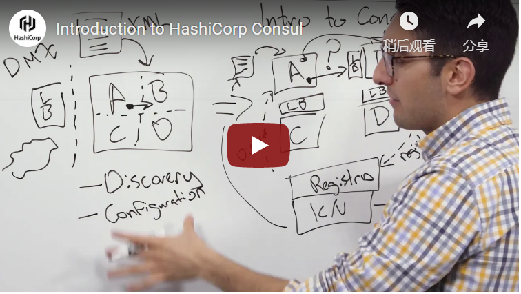

# Consul介绍

欢迎来到Consul的入门指南! 本指南是开始使用Consul的最佳地方。我们涵盖了Consul是什么，它能解决什么问题，它与现有软件的比较，以及你如何开始使用它。如果你熟悉Consul的基础知识，这个[文档](https://www.consul.io/docs)提供了更详细的可用功能参考。

## 什么是Consul

Consul是一个**服务网格**解决方案，提供了一个功能齐全的控制平面，具有服务发现、配置和分段功能。这些功能中的每一项都可以根据需要单独使用，也可以一起使用来构建一个完整的服务网格。Consul需要一个数据平面，并支持代理和原生集成模型。Consul提供了一个简单的内置代理，因此一切都可以开箱即用，但也支持第三方代理集成，如Envoy。 回顾下面的视频，向HashiCorp的联合创始人Armon了解更多关于Consul的信息。

请点击此链接查看视频：  [Consul介绍视频](https://www.youtube.com/watch?v=mxeMdl0KvBI)

 Consul的主要功能有:

* **服务发现** : Consul的客户端可以注册一个服务，比如api或mysql，其他客户端可以使用Consul来发现特定服务的提供者。使用DNS或HTTP，应用程序可以很容易地找到他们所依赖的服务。
*  **健康检查** : Consul客户端可以提供任何数量的健康检查，要么与给定的服务相关联（如： "webserver是否返回200 OK"），要么与本地节点相关联（如： "内存利用率是否低于90%"）。这些信息可以运维人员用来**监控集群的健康状况**，并被服务发现组件来路由流量（比如： 仅路由到健康节点）
*  **KV存储** ： 应用程序可以利用Consul的**层级K/V**存储来实现任何目的，包括动态配置、功能标记、协调、领导者选举等。Consul提供了HTTP API，使其非常简单以用。
*  **安全服务通信**： ****Consul可以为服务生成和分发TLS（ [传输层安全性协议](https://baike.baidu.com/item/TLS)）证书，以建立相互的TLS连接。可以使用[Intention](https://www.consul.io/docs/connect/intentions)来定义哪些服务被允许进行通信。服务隔离可以通过可以实时更改[Intention](https://www.consul.io/docs/connect/intentions)策略轻松管理，而不是使用复杂的网络拓扑结构和静态防火墙规则。 
* **多数据中心**: ****Consul支持开箱即用的**多数据中心**。这意味着Consul的用户不必担心建立额外的抽象层来发展到多个区域。 

Consul的设计对DevOps社区和应用开发人员都很友好，使其成为现代弹性基础架构的完美选择。

## Consul基础架构

Consul是一个分布式、高可用的系统。本节将介绍基础知识，特意省略一些不必要的细节，让你快速了解Consul的工作原理。更多细节，请参考深入的[架构概述](https://yushuai-w.gitbook.io/consul/consul-architecture)。 

每个为Consul提供服务的节点都会运行一个_Consul Agent_。运行代理不需要发现其他服务或获取/设置密钥/值数据。Agent负责对节点上的服务以及节点本身进行健康检查。 

_PS: 为了方便大家阅读，我这里补充一下， Consul Agent 分为两种模式， Server 和 Client模式，一般我们得部署模型是 Server + Client的模式（当然也可以纯Server）, Server 具有Client的全部功能， 但是由于Server负责存储数据，并且强一致性模型的缘故， Server数是有限的（3-5个Server节点，Client可以无限扩展的）更多信息可参考_[_架构概述_](https://yushuai-w.gitbook.io/consul/consul-architecture)_。_ 

Agent与一个或多个Consul Server对话。Consul Server是**存储**和**复制数据**的地方。Server本身会选出一个Leader。虽然Consul可以用一台Server来运作，但建议使用3到5台，以避免故障情况导致数据丢失。建议每个数据中心采用Consul服务器集群。

Server Agent维护着一个目录（Catalog），这个目录（Catalog）是由Agent提交的信息汇总形成的。目录维护着集群的高层视图，包括哪些服务可用，哪些节点运行这些服务，健康信息等。关于代理和目录如何交互，可以在[这里](https://yushuai-w.gitbook.io/consul/architecture/anti-entropy)找到。 

需要发现其他服务或节点的基础结构组件可以查询任何Consul Server或任何Consul Agent。Agent将查询自动转发到Server。

Agent会自动将查询转发给Server Agent。 每个数据中心都运行一个Consul Server集群。当有跨数据中心的服务发现或配置请求时，本地Consul Server将请求转发到远程数据中心并返回结果。

## 接下来步骤

* 查看[Consul与其他软件的比较](https://www.consul.io/intro/vs)，以评估它是否适合你现有的基础设施。
* 继续阅读[入门指南](https://learn.hashicorp.com/tutorials/consul/get-started-install)，让Consul启动并运行。

