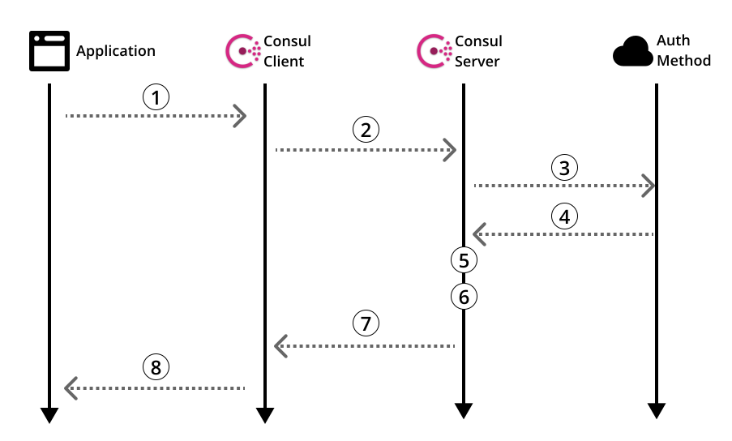

# ACL Auth Methods组件

适用1.5.0 +版本 +；

Auth方法是Consul中的一个组件，该组件通过受信任的外部方执行身份验证，然后授权创建可在本地数据中心内使用的ACL令牌。

## [»]()概述

如果不使用**Auth Method**组件，则需要一个受信任的运维人员，关键地参与到每个需要ACL令牌的应用程序的创建和安全引入过程中，并遵循**最小特权原则**，分配给这些令牌的策略。 

当运行在公有云或由集群调度程序控制的环境中时，应用程序可能已经拥有一个由平台确认安全的唯一身份标识了（_PS: 平台已确认时安全的_）。 集成Consul **Auth Method** 组件将允许使用这些凭证创建具有适当范围策略的ACL令牌，而无需额外的运维人员手工干预。 

在Consul 1.5.0中，在服务网格中，通过具有必要权限的Connect,  最大程度的简化了令牌的创建，减少了运维的手动干预。 

## [»]()支持类型

<table>
  <thead>
    <tr>
      <th style="text-align:left">Types</th>
      <th style="text-align:left">Consul Version</th>
    </tr>
  </thead>
  <tbody>
    <tr>
      <td style="text-align:left"><a href="https://www.consul.io/docs/acl/auth-methods/kubernetes"><code>kubernetes</code></a>
      </td>
      <td style="text-align:left">1.5.0+</td>
    </tr>
    <tr>
      <td style="text-align:left"><a href="https://www.consul.io/docs/acl/auth-methods/jwt"><code>jwt</code></a>
      </td>
      <td style="text-align:left">1.8.0+</td>
    </tr>
    <tr>
      <td style="text-align:left"><a href="https://www.consul.io/docs/acl/auth-methods/oidc"><code>oidc</code></a>
      </td>
      <td style="text-align:left">
        
1.8.0+

        
Enterprise

      </td>
    </tr>
  </tbody>
</table>

## [»]()运维配置

操作员需要使用API或命令行配置每个要信任的auth方法，然后才能被应用程序使用。 

* **身份验证** - 一个或多个**auth method**方法应配置为有关如何对应用程序凭据进行身份验证的详细信息。成功验证应用程序凭据将返回一组受信任的标识属性（如用户名）。这些可以通过`consul acl auth method`子命令或相应的[API](https://www.consul.io/api/acl/auth-methods)进行管理。配置的具体细节取决于类型，并在其自己的文档页面中进行了描述。
*  **授权** - 必须配置一个或多个**绑定规则**，以定义如何将每个身份验证方法返回的受信任标识属性转换为分配给所创建的ACL令牌的权限。可以使用`converacl binding rule`子命令或相应的[API](https://www.consul.io/api/acl/binding-rules)来管理它们。 

**注意** - 也要在任何连接的辅助数据中心中配置身份验证方法，且必须启用[ACL令牌复制](https://www.consul.io/docs/agent/options#acl_enable_token_replication)。身份验证方法需要能够创建本地令牌，且创建令牌只能在主数据中心和任何启用了ACL令牌复制的辅助数据中心。

## [»]()绑定规则

绑定规则运维人员设定的一种系统化的方式，自动关联[角色](https://www.consul.io/docs/acl/acl-system#acl-roles)和[服务标识](https://www.consul.io/docs/acl/acl-system#acl-service-identities)去创建新的令牌，而无需运维人员干预。 

通过**auth method** 身份验证成功将返回一组与已验证身份相对应的可信标识属性。返回的属性将与 auth method 设置的全量规则列表进行匹配， 确定最后应授予的权限，最后创建相应的令牌。 

每个绑定规则由两部分组成： 

* **选择器** - 一个逻辑查询，它必须与绑定规则的可信标识属性匹配才能应用于给定的登录尝试。语法使用github.com/hashicorp/go-bexpr与[API过滤功能](https://www.consul.io/api/features/filtering)近似。例如：`"serviceaccount.namespace==default and serviceaccount.name!=vault"`
* **绑定类型和名称** - 绑定规则可以通过名称将令牌绑定到[角色](https://www.consul.io/docs/acl/acl-system#acl-roles)或[服务标识](https://www.consul.io/docs/acl/acl-system#acl-service-identities)。可以使用纯字符串指定名称，也可以使用[HIL语法](https://github.com/hashicorp/hil)对绑定名称进行轻度模板化，以插入选择器语法可使用的相同值。例如：`"dev-${serviceaccount.name}"`

 当多个绑定规则匹配时，所有角色和服务标识将进行聚合，关联登陆过程创建的令牌。

_PS: 我理解原文的意思应该是这样，如果auth medho 返回结果能够匹配到多条规则，则权限将进行聚合，并创建响应令牌。_

## [»]()整体登陆流程

应用程序负责使用登录过程将其特定于auth method的secret交换为Consul ACL令牌：

1. 应用程序使用`consu login`子命令或[login API](https://www.consul.io/api/acl/acl#login-to-auth-method), 通过本地consul Client， 调用特定的 `auth method` 进行身份验证。应用程序在登录期间提供auth method的名称和secret\(可以理解为密码， 原文：secret bearer token \)。 
2. Consul Client 将登录请求转发到主要的consul Server Leader。 
3. Consul Leader然后使用auth方法特定的机制来验证所提供的承载令牌凭证。
4.  成功验证将可信身份属性返回给Consul Server Leader。 
5. Consul leader查询与指定的auth方法关联的已配置的绑定规则集，并仅选择那些与可信标识属性匹配的规则。 
6. Consul leader使用匹配的绑定规则生成角色和服务标识的列表，并将它们分配给在本地数据中心专门创建出来的令牌。如果没有生成，则登录尝试失败。 
7. 有关的`SecretID`和剩余细节将返回给初始Consul Client。 
8. Consul Client将令牌详细信息返回给应用程序。
9.  （后续）当不再需要令牌时，应用程序应使用`consul logout`子命令或[logout API](https://www.consul.io/api/acl/acl#login-to-auth-method)销毁其令牌。 

有关特定身份验证方法以及如何配置它们的详细信息，请单击侧栏中的身份验证方法类型的名称。

